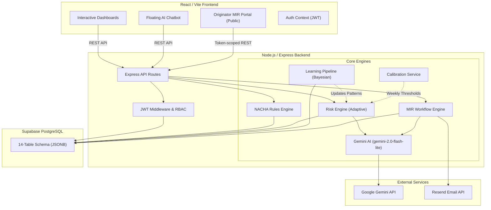
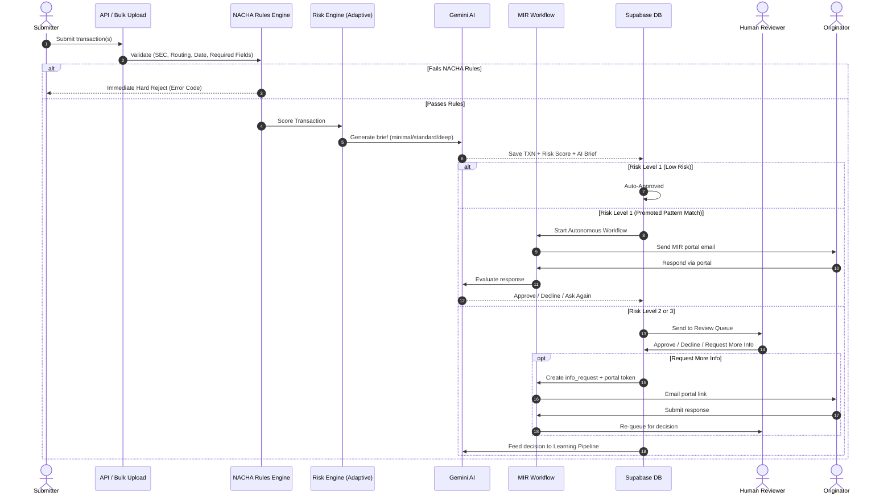

# 🏦 ACH Payment & Positive Pay AI Triage System v4.0

Welcome to the **ACH Payment & Positive Pay AI Triage System** — an enterprise-grade banking compliance and fraud-prevention platform. It merges strict **NACHA rules-based validation** with a **Generative AI Risk Engine** powered by Google Gemini, and a fully autonomous **More Information Request (MIR)** workflow that intelligently handles originator communication end-to-end.

> **Live Repository:** [https://github.com/Unique-Comp-Inc-NY/ACH-Project](https://github.com/Unique-Comp-Inc-NY/ACH-Project)

---

## 📊 Tech Stack Overview

| Category | Technology | Details |
|----------|-----------|---------|
| **Primary** | JavaScript (Node.js + React) | Backend API & Frontend UI |
| **Styling** | Vanilla CSS | ~54KB custom design system |
| **Database** | PostgreSQL via Supabase | PL/pgSQL stored procedures |
| **AI Engine** | Google Gemini 2.0 Flash Lite | Risk scoring & chatbot |
| **Email** | Resend API | MIR portal links & user provisioning |

### Frontend Stack
- **Framework:** React (JSX) with Vite 8.0.12
- **Language:** TypeScript 6.0.2
- **HTTP Client:** Axios 1.16.1
- **Routing:** React Router DOM 7.15.1
- **Markdown:** React Markdown 10.1.0
- **Dev Server:** Hot Module Reloading (HMR) on `localhost:5173`

### Backend Stack
- **Runtime:** Node.js (v18+)
- **Framework:** Express.js 4.18.3
- **AI Engine:** Google Generative AI (`@google/generative-ai`) 0.21.0 — model: `gemini-2.0-flash-lite`
- **Authentication:** JWT (`jsonwebtoken` 9.0.3), bcryptjs 3.0.3
- **Email:** Resend 6.12.4 (MIR portal + user provisioning), Nodemailer 8.0.10
- **Database Client:** Supabase JS 2.108.1
- **Utilities:** UUID 9.0.1, CORS 2.8.5, dotenv 16.4.5
- **Report Generation:** PptxGenJS 4.0.1
- **Real-time Auth:** Firebase Admin 14.0.0 (optional)
- **Dev Tool:** Nodemon 3.1.0

### Database
- **Primary:** Supabase (PostgreSQL 15+) with PL/pgSQL
- **Schema Version:** v4.0 — 14 total tables including MIR workflow tables
- **Storage Pattern:** JSONB document-model inside a relational wrapper (`data JSONB` column)

---

## 📑 Table of Contents

1. [Repository Structure](#-repository-structure)
2. [System Architecture](#️-system-architecture)
3. [Core Features & Functionality](#-core-features--functionality)
   - [NACHA Rules Validation](#1-nacha-rules-validation)
   - [AI Risk Engine & Adaptive Learning](#2-ai-risk-engine--adaptive-learning)
   - [More Information Request (MIR) Workflow](#3-more-information-request-mir-workflow--new-in-v40)
   - [Autonomous AI Workflow](#4-autonomous-ai-workflow)
   - [Positive Pay & Issued Check Register](#5-positive-pay--issued-check-register)
   - [Account ACH Filters](#6-account-ach-filters)
   - [Role-Based User Management](#7-role-based-user-management)
   - [Context-Aware AI Chatbot](#8-context-aware-ai-chatbot)
   - [Bulk Upload & NACHA File Parsing](#9-bulk-upload--nacha-file-parsing)
   - [Analytics & Audit Logging](#10-analytics--audit-logging)
4. [Transaction Lifecycle](#-transaction-lifecycle-flow)
5. [API Reference](#-api-reference)
6. [Database Schema](#️-database-schema)
7. [User Guide & Workflows](#-user-guide--workflows)
8. [Setup & Installation](#️-setup--installation)
9. [Environment Variables](#-environment-variables)
10. [Frequently Asked Questions](#-frequently-asked-questions)

---

## 📁 Repository Structure

```
ACH-project/
├── backend/                          # Node.js/Express Backend
│   ├── server.js                     # Main Express app + scheduled jobs
│   ├── package.json                  # Backend dependencies
│   ├── .env                          # Environment variables (gitignored)
│   │
│   ├── database/
│   │   ├── db.js                     # Supabase PostgreSQL adapter (JSONB)
│   │   ├── supabase.js               # Supabase client singleton
│   │   ├── firebase.js               # Firebase Admin client (optional)
│   │   ├── schema.sql                # SQLite schema (development reference)
│   │   ├── setup.sql                 # Supabase/PostgreSQL schema v4.0 (14 tables)
│   │   ├── seed.js                   # Database seed with default users & rules
│   │   ├── migrate-to-supabase.js    # Migration utility
│   │   └── migrate-to-firebase.js    # Firebase migration utility
│   │
│   ├── routes/
│   │   ├── auth.js                   # Login, user CRUD, password management
│   │   ├── transactions.js           # Full NACHA transaction lifecycle
│   │   ├── analytics.js              # Dashboard metrics & KPIs
│   │   ├── bulk.js                   # Bulk upload, NACHA/CSV parsing
│   │   ├── accounts.js               # Account ACH filter management
│   │   ├── positivePayRegister.js    # Issued check register
│   │   ├── exceptions.js             # Positive Pay exception dashboard
│   │   ├── chatbot.js                # AI chatbot with live DB injection
│   │   └── infoRequests.js           # MIR workflow + Originator Portal
│   │
│   ├── services/
│   │   ├── aiTriage.js               # Gemini AI: tiered briefs, score adjustment
│   │   ├── riskEngine.js             # Rules engine: scoring, fingerprint, drift
│   │   ├── learningPipeline.js       # Bayesian learning, promotion, autonomy
│   │   ├── calibrationService.js     # Weekly calibration & drift alerting
│   │   ├── nachaParser.js            # NACHA flat-file & CSV parser
│   │   └── chatbotLLM.js             # Chatbot LLM helper
│   │
│   ├── middleware/
│   │   └── auth.js                   # JWT verification & RBAC middleware
│   │
│   ├── generate_transactions.js      # Synthetic transaction generator
│   ├── generate_demo_data.js         # Demo dataset generator
│   ├── generate_5_rules_demo.js      # 5-rule demo set generator
│   ├── generate_100_all_rules.js     # Full 100-rule set generator
│   ├── generate_ppt.js               # PowerPoint report generator
│   ├── delete_supabase.js            # Supabase data cleanup utility
│   └── delete_collections.js        # Collection-level cleanup
│
├── frontend/                         # React + Vite Frontend
│   ├── src/
│   │   ├── App.jsx                   # Root router (public + authenticated shell)
│   │   ├── main.jsx                  # React DOM entry
│   │   ├── index.css                 # Main design system (~54KB)
│   │   ├── style.css                 # Supplemental styles
│   │   │
│   │   ├── api/
│   │   │   └── client.js             # Axios API client (all endpoints)
│   │   │
│   │   ├── context/
│   │   │   └── AuthContext.jsx       # JWT auth context + user state
│   │   │
│   │   ├── components/
│   │   │   ├── Chatbot.jsx           # Floating AI chatbot widget
│   │   │   └── TransactionDetailModal.jsx  # Transaction detail overlay
│   │   │
│   │   └── pages/
│   │       ├── Dashboard.jsx         # KPI dashboard with live stats
│   │       ├── TransactionIntake.jsx # Single transaction form
│   │       ├── BulkUpload.jsx        # Bulk/NACHA/CSV upload
│   │       ├── ReviewQueue.jsx       # Review queue + MIR panel
│   │       ├── ExceptionDashboard.jsx # Positive Pay exceptions
│   │       ├── AccountManager.jsx    # ACH account filters
│   │       ├── IssuedCheckRegister.jsx # Check register management
│   │       ├── Analytics.jsx         # Charts, trends, AI stats
│   │       ├── AuditLog.jsx          # Immutable audit trail viewer
│   │       ├── UserManagement.jsx    # Admin: user CRUD
│   │       ├── OriginatorPortal.jsx  # Public MIR response portal
│   │       ├── LoginPage.jsx         # Authentication page
│   │       └── RegisterPage.jsx      # (Admin-controlled registration)
│   │
│   ├── public/                       # Static assets
│   ├── index.html                    # HTML entry
│   ├── tsconfig.json                 # TypeScript config
│   └── package.json                  # Frontend dependencies
│
├── ACH_Complete_Postman_Collection.json  # Full Postman API collection
├── generate_manual.js                    # Documentation generator
├── package.json                          # Root package
└── README.md                             # This file
```

---

## 🏗️ System Architecture

The application uses a modern React frontend, a Node.js/Express backend, and Supabase (PostgreSQL) as the persistent data layer. Gemini AI is integrated into both the risk engine and the chatbot.



### Background Scheduled Jobs (server.js)

| Job | Interval | Description |
|-----|----------|-------------|
| Distribution Drift Check | On startup (30s delay), then every 4 hours | Alerts if risk level distribution drifts beyond baseline |
| Weekly Calibration | Every 7 days | Adapts rule weights, originator trust scores, thresholds |
| Render Self-Ping | Every 2.5 minutes | Prevents Render free tier from sleeping |

---

## ✨ Core Features & Functionality

### 1. NACHA Rules Validation

Every transaction undergoes rigorous structural validation before the AI sees it.

- **SEC Code Validation:** Validates Standard Entry Class codes — `PPD` (consumer), `CCD` (corporate), `WEB` (online), `TEL` (telephone), `IAT` (international), etc.
- **Routing Number Verification:** Executes the **Mod-10 checksum** algorithm (ABA routing number validation).
- **Effective Date Constraints:** Validates transactions are not advance-dated beyond NACHA's 5-day window.
- **Required Field Enforcement:** `company_name`, `company_id`, `amount`, `account_number`, `routing_number` are mandatory.

### 2. AI Risk Engine & Adaptive Learning

Once a transaction passes NACHA validation, it enters the multi-layer risk engine.

**Risk Scoring (`riskEngine.js`):**
- **Adaptive Rule Weights:** Each rule has both a static `weight` and a learned `learned_weight` updated by the calibration service. The engine prefers `learned_weight` if available.
- **Co-occurrence Multipliers:** When correlated rule pairs fire together (e.g., `VEL_001` + `AMT_002`), a co-occurrence bonus amplifies the combined score.
- **Per-SEC-Code Multipliers:** IAT transactions are treated more strictly (lower threshold); PPD and TEL are treated more leniently.
- **Originator Trust Adjustment:** Trust scores (0-100) computed from historical approval/decline rates per `company_id`. Final score adjusted by a `0.85-1.22x` multiplier.
- **Superlinear Velocity Scoring:** Velocity rule (`VEL_001`) severity scales non-linearly beyond the spike threshold.
- **Soft Boundary Zone Detection:** Transactions within ±4 points of any risk level boundary trigger a `boundary_zone` fingerprint and deeper AI analysis.
- **Dynamic Threshold Calibration:** L1/L2/L3 thresholds are loaded from the database (10-minute cache) and adjusted weekly.

**Risk Levels:**

| Level | Score Range | Action |
|-------|------------|--------|
| **Level 1 (Low Risk)** | < 40 (default) | Auto-approved, compliance notes generated |
| **Level 2 (Medium Risk)** | 40-60 | Sent to manual review queue with AI brief |
| **Level 3 (High Risk)** | > 60 | Critical flag; immediate escalation required |

**AI Briefs (`aiTriage.js`) — Three tiers based on complexity:**
- **`minimal`:** Low complexity L2 transactions (brief flag summary)
- **`standard`:** Standard L2 transactions
- **`deep`:** L3, 2+ critical flags, score >=75, or boundary zone — includes a *"What Would Resolve This"* counterfactual explanation

**AI Score Adjustment:** Gemini can apply a bounded `0-15 point` score delta for contextual risk not captured by rules. Applied with a 2.5s timeout to prevent latency impact.

### 3. More Information Request (MIR) Workflow — *New in v4.0*

The MIR system enables the bank to formally request additional information from the originator before making a final decision.

**Workflow:**
1. A reviewer clicks **"Request More Info"** in the Review Queue.
2. They select a **category** and write a message.
3. The system creates an `info_request` record with a **cryptographically secure 64-character portal token** (valid for 72 hours by default), marks the transaction `more_info_required`, and sends the originator an email via Resend with a unique portal link.
4. The originator visits the **Originator Portal** (`/portal/:token`) — a public page requiring no login.
5. The originator submits their response.
6. The transaction re-enters the review queue for a human or autonomous decision.

**Available MIR Categories:** Identity Verification, Authorization Proof, Business Purpose Clarification, Amount Discrepancy, Account Ownership, Sanctions Review, Duplicate Explanation, Custom.

**Configurable via `.env`:**

| Variable | Default | Description |
|----------|---------|-------------|
| `MIR_TOKEN_EXPIRY_HOURS` | 72 | Portal link time-to-live |
| `MIR_SLA_HOURS` | 48 | Originator response SLA deadline |
| `MIR_MAX_ROUNDS` | 5 | Max info request rounds before escalation |

**MIR Sidebar Badge:** Live count of transactions awaiting originator responses — distinct from the main pending review count — auto-refreshing every 30 seconds.

### 4. Autonomous AI Workflow

When the learning pipeline promotes a pattern, the system can handle future matching transactions **without any human involvement**.

**Autonomous Steps:**
1. New transaction matches a promoted pattern.
2. AI automatically sends an MIR portal request.
3. AI evaluates the originator's response using Gemini + learned Q&A examples from the pattern's `workflow_playbook`.
4. AI decides: **approve / decline / ask again** (up to `MIR_MAX_ROUNDS`).
5. All steps are tagged `actor: 'AI_AUTOMATION'` in audit logs.
6. Human can intervene and override at any point via the **"Override AI"** action.

**Autonomy Safety Limits:**
- Never autonomous on Level 3 transactions
- Score cap for autonomous approval: 72
- L3 conflict guard prevents any auto-approve on critical-risk transactions

### 5. Positive Pay & Issued Check Register

Fraud detection tool for corporate check matching.

- **Check Register Upload:** Companies upload issued checks (Check Number, Account, Payee, Amount, Date).
- **Exception Types:** Amount Mismatch, Payee Mismatch, Check Not Found, Duplicate Presentation, Stale Date.
- **Exception Dashboard:** Exceptions are isolated from the main review queue for specialized review.
- **Pay or Return:** Reviewers choose to `Pay` (override) or `Return` (reject) each exception.

### 6. Account ACH Filters

Per-account rules that override the standard AI scoring pipeline.

- **Block All:** Completely blocks an account from receiving ACH debits.
- **Allow All:** Whitelists the account — bypasses risk scoring for all transactions.
- **Review All:** Forces every transaction on this account into the manual review queue, regardless of AI risk score.

### 7. Role-Based User Management

A locked-down admin-managed user system with no public self-registration.

**Four System Roles:**

| Role | Permissions |
|------|------------|
| `admin` | Full access — CRUD on users, transactions, all dashboards |
| `supervisor` | Review & override any transaction, all dashboards |
| `analyst` | Read-only — metrics, analytics, audit log |
| `reviewer` | Review Queue only — approve/decline pending transactions, initiate MIR |

**Admin Features:**
- Create users with auto-generated or custom passwords
- Welcome email via **Resend API** on account creation
- Deactivate/reactivate users instantly
- Force password reset (new credentials sent via email)
- Full user delete with critical-severity audit log entry
- JWT tokens expire in **12 hours**

### 8. Context-Aware AI Chatbot

A floating chatbot (bottom-right corner) available on all authenticated screens.

- **Live Database Injection:** Receives a real-time database snapshot on every turn — pending counts, risk distributions, learned patterns, exception counts, MIR awaiting counts.
- **Transaction Lookup:** Type a transaction ID (e.g., `TXN-A1B2C3D4`) to fetch the full record including audit trail and AI brief.
- **Conversational Actions (Admin/Reviewer):** `"Approve TXN-12345"` or `"Reject TXN-98765 because..."` — the bot executes the action and logs it to the audit trail.
- **Analytical Q&A:** `"Why do we have so many Level 3 risks?"` or `"What is our auto-resolution rate this week?"`
- **Model:** `gemini-3.1-flash-lite` with `temperature: 0.75`

### 9. Bulk Upload & NACHA File Parsing

- **JSON Array Upload:** Submit an array of transaction objects for batch processing.
- **Native NACHA Flat-File Parsing:** Upload a raw NACHA `.ach` file — the parser extracts File Headers, Batch Headers, Entry Detail records, and Addenda records.
- **CSV Upload:** Upload a CSV file; the parser maps columns to transaction fields.
- **Async Job Processing:** Large batches run asynchronously with a job ID. Poll `GET /api/bulk/status/:jobId` for progress.
- **Batch Size Control:** Configurable `batch_size` (default: 10, max: 50).

### 10. Analytics & Audit Logging

- **Dashboard KPIs:** Total volume, auto-approval rate, pending counts, exception counts, MIR awaiting count — live-refreshed every 30 seconds.
- **Analytics Page:** Risk distribution trends, daily processed volumes, AI learning milestones, approval/decline rates, processing time stats.
- **Immutable Audit Trail:** Chronological log of every system event. Actors labelled `AI`, `HUMAN`, or `AI_AUTOMATION`.

---

## 🔄 Transaction Lifecycle Flow



---

## 📡 API Reference

All endpoints are prefixed with `/api`. Most require `Authorization: Bearer <token>` header.

### Authentication (`/api/auth`)

| Method | Endpoint | Auth | Description |
|--------|----------|------|-------------|
| `POST` | `/auth/login` | None | Login; returns JWT token |
| `GET` | `/auth/me` | Required | Get current user info |
| `POST` | `/auth/create-user` | Admin | Create new user + send welcome email |
| `GET` | `/auth/users` | Admin | List all users |
| `PATCH` | `/auth/users/:user_id` | Admin | Update role, status, or reset password |
| `DELETE` | `/auth/users/:user_id` | Admin | Permanently delete user |
| `POST` | `/auth/change-password` | Required | Change own password |

### Transactions (`/api/transactions`)

| Method | Endpoint | Auth | Description |
|--------|----------|------|-------------|
| `GET` | `/transactions` | Required | List transactions (filter by status, risk_level, sec_code) |
| `POST` | `/transactions` | Required | Submit new transaction (triggers full scoring pipeline) |
| `GET` | `/transactions/:id` | Required | Get transaction with audit logs & decisions |
| `PATCH` | `/transactions/:id/decide` | Required | Approve / decline / review decision |
| `DELETE` | `/transactions/:id` | Admin | Delete transaction |

### MIR & Originator Portal (`/api`)

| Method | Endpoint | Auth | Description |
|--------|----------|------|-------------|
| `POST` | `/transactions/:id/request-info` | Required | Create MIR request + send portal email |
| `GET` | `/transactions/:id/info-requests` | Required | Get all MIR rounds for a transaction |
| `POST` | `/transactions/:id/override-ai` | Required | Human override of autonomous AI decision |
| `GET` | `/portal/:token` | None (Public) | Originator Portal — load request by token |
| `POST` | `/portal/:token/respond` | None (Public) | Submit originator's response |

### Bulk Upload (`/api/bulk`)

| Method | Endpoint | Auth | Description |
|--------|----------|------|-------------|
| `POST` | `/bulk/upload` | Required | Upload transactions (JSON / CSV / NACHA format) |
| `GET` | `/bulk/status/:jobId` | Required | Poll batch job progress |

### Other Routes

| Method | Endpoint | Auth | Description |
|--------|----------|------|-------------|
| `GET` | `/analytics/dashboard` | Required | Dashboard KPIs |
| `GET` | `/analytics/trends` | Required | Risk trends over time |
| `GET` | `/accounts` | Required | List account ACH filters |
| `POST` | `/accounts` | Admin | Create account filter |
| `GET` | `/check-register` | Required | List issued checks |
| `POST` | `/check-register` | Required | Add issued check |
| `GET` | `/exceptions` | Required | List Positive Pay exceptions |
| `PATCH` | `/exceptions/:id` | Required | Pay or Return an exception |
| `POST` | `/chatbot/message` | Optional | Send chatbot message |
| `GET` | `/health` | None | Service health check |

---

## 🗄️ Database Schema

The system uses Supabase PostgreSQL with a JSONB document wrapper pattern. All data is stored in a `data JSONB` column within each table, enabling flexible schema evolution without migrations.

**14 Tables (v4.0):**

| Table | Description |
|-------|-------------|
| `transactions` | Core ACH transaction records with full NACHA fields + MIR state |
| `risk_rules` | Configurable NACHA risk rules with adaptive weights |
| `return_codes` | NACHA return code reference (R02, R03, ...) |
| `users` | System users (admin, supervisor, analyst, reviewer) |
| `audit_logs` | Immutable event log (all actions by AI, Human, AI_AUTOMATION) |
| `human_decisions` | Structured decision records with rich metadata |
| `review_decisions` | Detailed reviewer notes and verification data |
| `learning_patterns` | Extracted patterns with Bayesian confidence scores |
| `batch_jobs` | Bulk upload job tracking |
| `accounts` | Account ACH filter rules |
| `acl_filter_rules` | Access control list entries |
| `check_register` | Issued check manifest for Positive Pay |
| `info_requests` | *(v4.0)* MIR requests with portal tokens and SLA deadlines |
| `transaction_lifecycles` | *(v4.0)* Full lifecycle audit including autonomous AI steps |

**Key Transaction Status Values:**
```
pending  ->  under_review  ->  more_info_required  ->  ai_workflow  ->  auto_approved | approved | declined
```

---

## 📖 User Guide & Workflows

### Scenario A: Provisioning a New Employee
1. Log in as an **Admin**.
2. Navigate to **User Management** via the sidebar.
3. Click **Create New User** and fill in Name, Username, Email, and Role.
4. Click **Create User Account**.
5. System generates a password and sends it to the employee's email via Resend. If Resend is not configured, credentials are shown on screen and logged to the server console.

### Scenario B: Reviewing a Pending Transaction
1. Log in as a **Reviewer** or **Supervisor**.
2. Click the **Review Queue** badge in the sidebar (red = pending, yellow = awaiting MIR responses).
3. Expand a transaction to view the **AI Risk Brief**, risk flags, and audit history.
4. Choose: **Approve / Decline** to finalize, or **Request More Info** to open the MIR panel.

### Scenario C: Handling a More Information Request
1. Reviewer submits an MIR for a transaction.
2. Originator receives an email with a unique portal link.
3. Originator visits the **Originator Portal** — no login required.
4. Originator submits a response.
5. Transaction returns to the Review Queue.
6. Full MIR history is viewable in the **History** tab of the Review Modal.

### Scenario D: Using the AI Chatbot
1. Click the chatbot icon (bottom-right on any page).
2. Ask: *"How many transactions are pending review?"* — live database query.
3. Ask: *"Show me details for TXN-A1B2C3D4"* — full record with AI brief.
4. Execute: *"Approve TXN-12345"* or *"Reject TXN-98765 because payee mismatch"* (Admin/Reviewer only).

### Scenario E: Bulk Uploading Transactions
1. Navigate to **Bulk Upload**.
2. Select format: **JSON**, **CSV**, or **NACHA flat file**.
3. Paste or upload your data.
4. The system returns a `jobId` and begins processing asynchronously.
5. Track progress via the status endpoint or the Bulk Upload page.

---

## 🛠️ Setup & Installation

### Prerequisites
- **Node.js** v18.x or higher
- **Google Gemini API Key** — [Get one from Google AI Studio](https://aistudio.google.com)
- **Supabase Project** — PostgreSQL database with the v4.0 schema applied
- **Resend API Key** — For MIR portal emails and user provisioning (optional but recommended)

### 1. Clone & Install

```bash
git clone https://github.com/Unique-Comp-Inc-NY/ACH-Project.git
cd ACH-Project
cd backend && npm install
cd ../frontend && npm install
```

### 2. Configure Environment Variables
Create `backend/.env` (see [Environment Variables](#-environment-variables) below).

### 3. Set Up Supabase Database
1. Create a Supabase project at [supabase.com](https://supabase.com).
2. Go to **SQL Editor** > **New Query**.
3. Paste the contents of `backend/database/setup.sql` and click **Run**.
4. The schema is idempotent — safe to re-run on an existing database.

### 4. Launch the Application

**Terminal 1 — Backend:**
```bash
cd backend
npm run dev     # Development with nodemon
# or
npm start       # Production
```
You should see: `Gemini AI initialized (Real Mode)` and `API at http://localhost:3001`

**Terminal 2 — Frontend:**
```bash
cd frontend && npm run dev
```
Open `http://localhost:5173` in your browser.

### 5. First Login
- **Username:** `kash234`
- **Password:** *(check `database/seed.js` or server console on first startup)*

### 6. Generate Demo Data (Optional)
```bash
node backend/generate_demo_data.js        # Sample transactions
node backend/generate_100_all_rules.js    # Full 100-rule set
```

---

## 🔑 Environment Variables

Create `backend/.env`:

```env
# Core
PORT=3001
GEMINI_API_KEY=your_gemini_api_key_here

# Supabase
SUPABASE_URL=https://your-project.supabase.co
SUPABASE_SERVICE_KEY=your_supabase_service_role_key

# Resend Email (MIR Portal + User Provisioning)
RESEND_API_KEY=re_your_resend_api_key
RESEND_FROM=noreply@yourdomain.com

# SMTP (fallback for nodemailer, optional)
SMTP_HOST=smtp.gmail.com
SMTP_PORT=587
SMTP_SECURE=false
SMTP_USER=your_email@gmail.com
SMTP_PASS=your_app_password

# JWT
JWT_SECRET=your_strong_jwt_secret

# MIR Workflow
MIR_TOKEN_EXPIRY_HOURS=72
MIR_SLA_HOURS=48
MIR_MAX_ROUNDS=5
PORTAL_BASE_URL=https://your-frontend-domain.com

# Firebase (optional)
FIREBASE_PROJECT_ID=your_firebase_project_id
FIREBASE_PRIVATE_KEY=your_firebase_private_key
FIREBASE_CLIENT_EMAIL=your_firebase_client_email

# Render Deployment (auto-set by Render)
RENDER_EXTERNAL_URL=https://your-app.onrender.com
FRONTEND_URL=https://your-frontend.onrender.com
```

> **Security Warning:** Never commit `.env` to source control. `backend/.env` is listed in `.gitignore`.

---

## 🔐 Security & Compliance

| Feature | Implementation |
|---------|---------------|
| **JWT Authentication** | Stateless sessions, 12-hour expiry |
| **RBAC** | Four roles with granular endpoint-level enforcement |
| **NACHA Compliance** | Full structural validation on every transaction |
| **Immutable Audit Trail** | All events logged with actor, severity, and timestamp |
| **Password Security** | bcryptjs with 12 salt rounds |
| **CORS Protection** | Strict allowlist: `FRONTEND_URL`, `localhost:5173`, `localhost:3000` |
| **MIR Portal Security** | 64-byte cryptographically random tokens; time-limited (72 hrs default) |
| **Secret Scanning** | GitHub push protection blocks committed API keys |

---

## 🚀 Deployment

This system is designed to run on [Render](https://render.com) but is compatible with any Node.js hosting.

### Current Deployment
- **Backend:** Render Web Service
- **Frontend:** Render Static Site
- **Database:** Supabase (PostgreSQL)

### Deployment Checklist
1. **Environment Variables:** Set all secrets via your platform's secure env management.
2. **Database:** Run `backend/database/setup.sql` against your Supabase instance.
3. **Backend:** Set `NODE_ENV=production` and `RENDER_EXTERNAL_URL`.
4. **CORS:** Ensure `FRONTEND_URL` env var is set on the backend.
5. **SSL/TLS:** Enforce HTTPS — Render handles this automatically.
6. **Heartbeat:** The backend self-pings every 2.5 minutes to prevent Render free-tier sleep.

### Production Tips
- Use Supabase **Connection Pooler** for high-traffic scenarios.
- Enable Supabase **Row Level Security (RLS)** for additional data isolation.
- Rotate Resend and Gemini API keys periodically.
- Monitor weekly calibration logs — `insufficient_data` means more human decisions are needed before self-tuning activates.

---

## ❓ Frequently Asked Questions

**Q: What happens if the Gemini API is unavailable?**
A: The system falls back to a rule-based simulation mode. Transactions are still scored via `riskEngine.js`; only AI brief generation and contextual score adjustment are skipped.

**Q: What is the difference between `pending` and `more_info_required` status?**
A: `pending` = waiting for a human reviewer. `more_info_required` = reviewer sent an MIR to the originator and is awaiting their response. Both appear in the Review Queue but are filterable separately.

**Q: How does the AI Learning Pipeline promote patterns?**
A: When a pattern accumulates 5+ unique transactions with 85%+ approval confidence (Bayesian Beta prior prevents premature promotion), it gets promoted. After demotion, the re-promotion threshold rises to 90%. After 3 demotions the pattern is frozen permanently.

**Q: Can a Reviewer create or delete transactions?**
A: No. RBAC strictly prevents Reviewers from creating or deleting transactions. Only `Admin` users can perform those operations.

**Q: Why does the system use JSONB instead of standard relational columns?**
A: The JSONB wrapper (`data JSONB`) allows schema evolution without database migrations. All equality filters are still pushed to Postgres via PostgREST.

**Q: Is the Originator Portal secure without authentication?**
A: Yes. The portal URL contains a 64-byte cryptographically random token that expires after 72 hours (configurable). Without the exact token, there is no access.

**Q: What NACHA SEC codes are supported?**
A: PPD, CCD, WEB, TEL, IAT, CTX, ARC, RCK, POP, BOC, ENR, and more. The risk engine applies per-SEC-code multipliers (IAT is stricter due to cross-border risk).

**Q: How do I generate a PowerPoint report?**
A: Run `node backend/generate_ppt.js` from the backend directory.

**Q: How do I reset the default admin password?**
A: Check `backend/database/seed.js`, or update the `password_hash` field for the admin user directly in Supabase.

**Q: What are the Anthropic/Claude keys for?**
A: The project currently uses Google Gemini as the primary AI engine. Any Anthropic keys in `.env` are vestiges from earlier prototyping and are not used by the current codebase.

---

## 📦 Key Dependencies Summary

### Backend
| Package | Version | Purpose |
|---------|---------|---------|
| `express` | 4.18.3 | RESTful API framework |
| `@google/generative-ai` | 0.21.0 | Gemini AI integration |
| `@supabase/supabase-js` | 2.108.1 | Supabase/PostgreSQL client |
| `firebase-admin` | 14.0.0 | Firebase Admin SDK (optional) |
| `resend` | 6.12.4 | Email delivery (MIR + user provisioning) |
| `nodemailer` | 8.0.10 | SMTP fallback email |
| `jsonwebtoken` | 9.0.3 | JWT auth tokens |
| `bcryptjs` | 3.0.3 | Password hashing (12 rounds) |
| `pptxgenjs` | 4.0.1 | PowerPoint report generation |
| `uuid` | 9.0.1 | Unique ID generation |

### Frontend
| Package | Version | Purpose |
|---------|---------|---------|
| `react` + `react-dom` | (Vite default) | UI framework |
| `vite` | 8.0.12 | Build tool & dev server |
| `typescript` | ~6.0.2 | Type safety |
| `axios` | 1.16.1 | HTTP client |
| `react-router-dom` | 7.15.1 | Client-side routing |
| `react-markdown` | 10.1.0 | Render AI brief markdown |

---

*ACH Payment & Positive Pay AI Triage System — Enterprise-grade financial compliance with autonomous AI workflows.*

*v4.0 — Last Updated: June 29, 2026*
