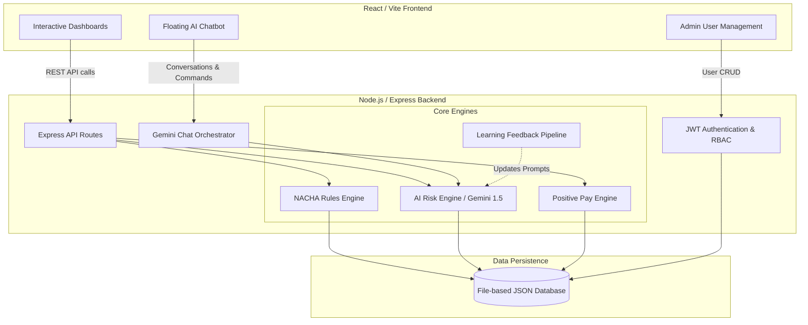
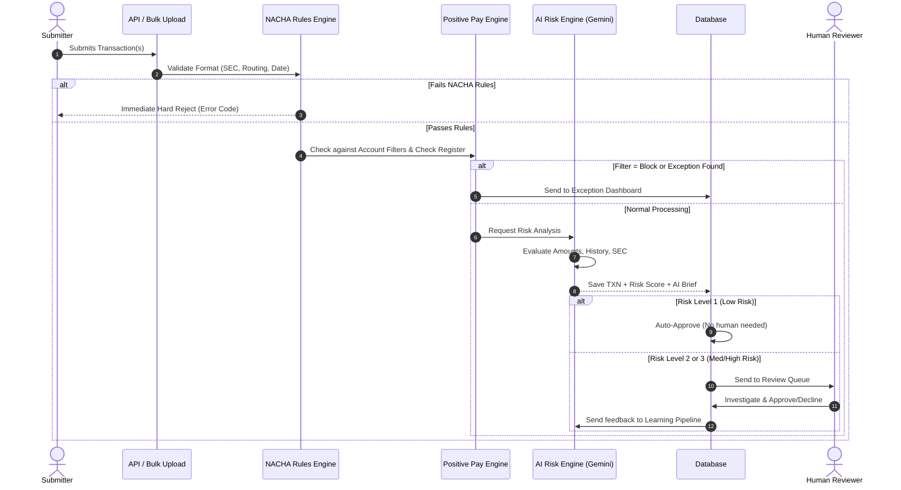

# 🏦 ACH Payment & Positive Pay AI Triage System v3.0

Welcome to the **ACH Payment & Positive Pay AI Triage System**! 

This system is a state-of-the-art, enterprise-grade banking compliance and fraud-prevention application. It merges strict **NACHA rules-based validation** with a **generative AI Risk Engine** powered by Google Gemini. The platform is designed to process ACH transfers, cross-reference checks against a Positive Pay register, assign intelligent risk scores, learn from human reviews, and provide an interactive AI chatbot assistant—all wrapped in a secure, role-based architecture.

---

## 📑 Table of Contents
1. [System Architecture](#️-system-architecture)
2. [Core Features & Functionality](#-core-features--functionality)
   - [NACHA Rules Validation](#1-nacha-rules-validation)
   - [AI Risk Engine & Learning Pipeline](#2-ai-risk-engine--learning-pipeline)
   - [Positive Pay & Issued Check Register](#3-positive-pay--issued-check-register)
   - [Account ACH Filters](#4-account-ach-filters)
   - [Role-Based User Management & SMTP](#5-role-based-user-management--smtp)
   - [Context-Aware AI Chatbot](#6-context-aware-ai-chatbot)
   - [Bulk Upload & Transaction Intake](#7-bulk-upload--transaction-intake)
   - [Analytics & Audit Logging](#8-analytics--audit-logging)
3. [Transaction Lifecycle](#-transaction-lifecycle-flow)
4. [User Guide & Workflows](#-user-guide--workflows)
5. [Setup & Installation](#-setup--installation)
6. [Frequently Asked Questions (FAQ)](#-frequently-asked-questions)

---

## 🏗️ System Architecture

The application is split into a modern React frontend and a Node.js/Express backend. 



---

## ✨ Core Features & Functionality

### 1. NACHA Rules Validation
Every transaction submitted to the system undergoes rigorous structural validation before the AI even sees it. This prevents the system from processing fundamentally invalid ACH files.
* **SEC Code Validation:** Ensures the transaction uses valid Standard Entry Class codes (e.g., `PPD` for consumer, `CCD` for corporate, `WEB` for online, `IAT` for international).
* **Routing Number Verification:** Executes the Mod-10 checksum algorithm to ensure the receiving bank's ABA routing number is mathematically valid.
* **Effective Date Constraints:** Validates that transactions are not advance-dated beyond the NACHA-allowed 5-day window. Transactions failing these rules are immediately rejected with standardized ACH return codes.

### 2. AI Risk Engine & Learning Pipeline
Once a transaction passes basic structural rules, it is sent to the Gemini-powered AI Risk Engine.
* **Intelligent Risk Scoring:** The AI analyzes the amount, company history, account type, and SEC code to generate a Risk Score from `0` to `100`.
* **Risk Levels:**
  * **Level 1 (Low Risk):** Transactions are auto-approved, bypassing manual review.
  * **Level 2 (Medium Risk):** Flagged for manual review due to unusual patterns (e.g., high amount for a new vendor).
  * **Level 3 (High Risk):** Severely flagged. Immediate attention required.
* **AI Briefs:** The AI generates a human-readable summary explaining *why* it assigned the score, highlighting specific red flags (e.g., "Amount is 300% higher than historical average for this SEC code").
* **Continuous Learning Pipeline:** When a human reviewer overrides or confirms the AI's decision, the Learning Pipeline extracts the reasoning and saves it as a new "learned pattern." The AI uses these promoted patterns to score future transactions more accurately.

### 3. Positive Pay & Issued Check Register
Positive Pay is an automated fraud detection tool primarily used for corporate checks.
* **Check Register:** Companies upload a manifest of checks they have legitimately issued (Check Number, Account, Payee, Amount).
* **Match Processing:** When an incoming transaction claims to be cashing a check, the system compares it against the register.
* **Exception Generation:** If there is a discrepancy (Amount Mismatch, Payee Mismatch, or Duplicate Check), the transaction is blocked and sent to the **Exception Dashboard**.
* **Exception Handling:** A reviewer must manually investigate exceptions and choose to either `Pay` (override) or `Return` (reject) the item.

### 4. Account ACH Filters
Administrators can set specific rules for specific bank accounts to override standard logic.
* **Block All:** Completely freezes an account from receiving ACH debits.
* **Allow All:** Whitelists the account for all transactions.
* **Review All:** Forces every single transaction hitting this account into the manual review queue, regardless of how low the AI risk score is.

### 5. Role-Based User Management & SMTP
A strictly locked-down administrative portal handles user access. There is no public registration.
* **Four System Roles:**
  * `Admin`: Full system access, can create/delete users, can process CRUD on transactions.
  * `Supervisor`: Can review transactions and override decisions made by standard reviewers.
  * `Analyst`: View-only access to metrics, dashboards, and audit logs.
  * `Reviewer`: Standard operational role; can only approve or decline pending items in the queue.
* **Automated SMTP Provisioning:** When an Admin creates a new user, the system generates a secure, randomized password and emails it directly to the user using Nodemailer. 
* **User Control:** Admins can instantly deactivate users to revoke login access or trigger password resets.

### 6. Context-Aware AI Chatbot
A floating AI assistant remains available on all screens, functioning as a system co-pilot.
* **Live Database Injection:** The chatbot does not just use pre-trained knowledge. It is dynamically injected with the exact, up-to-the-second state of the database (total volume, pending counts, recent logs).
* **Analytical Q&A:** You can ask complex questions like *"Why do we have so many Level 3 risks today?"* or *"What is our current auto-resolution rate?"*
* **Transaction Lookup:** Typing a transaction ID (e.g., `TXN-A1B2C3D4`) prompts the bot to fetch the complete record, including audit trails and AI risk briefs, and present it in the chat.
* **Conversational Approvals (Admins/Reviewers):** Instead of navigating to the queue, authorized users can simply type *"Approve TXN-12345"* or *"Reject TXN-98765"*. The bot interprets the intent, updates the database, logs the audit event, and confirms the action.

### 7. Bulk Upload & Transaction Intake
* **Single Intake:** A detailed form for submitting manual, one-off ACH transfers.
* **Bulk Upload (JSON/CSV):** Allows operators to drag-and-drop a file containing hundreds of transactions. The system processes them in batch, running NACHA validation and AI scoring simultaneously.

### 8. Analytics & Audit Logging
* **Dashboard Analytics:** Visual representations of system health, risk distributions, daily processed volumes, and AI learning milestones.
* **Immutable Audit Trail:** A strict, chronological log of every event. It records user logins, transaction creations, human decisions, exception handling, and user management changes. You always know exactly *who* did *what* and *when*.

---

## 🔄 Transaction Lifecycle Flow



---

## 📖 User Guide & Workflows

### Scenario A: Provisioning a New Employee
1. Log in as an **Admin** (`kash234`).
2. Navigate to the **User Management** page via the sidebar.
3. Click **Create New User**.
4. Enter the employee's Name, Username, Email, and select their Role (e.g., `Reviewer`).
5. Click **Create User Account**. 
6. The system generates a password and emails it to the employee. (If SMTP is offline, the password is shown securely on your screen to copy/paste).

### Scenario B: Reviewing Pending Transactions
1. Log in as a **Reviewer** or **Supervisor**.
2. Notice the red badge on the **Review Queue** in the sidebar. Click it.
3. You will see all Level 2 and Level 3 transactions.
4. Expand a transaction to read the **AI Review Brief**, which explains exactly why the AI flagged it (e.g., "First time seeing this routing number").
5. Review the audit history and risk flags.
6. Click **Approve** or **Decline**. Your decision is recorded in the Audit Log and fed back into the AI Learning Pipeline.

### Scenario C: Using the AI Chatbot to Manage Exceptions
1. Open the Chatbot in the bottom right corner.
2. Type: *"How many Positive Pay exceptions do we have?"*
3. The bot reads the live database and replies: *"There are currently 3 exceptions pending review."*
4. Type: *"Show me details for TXN-EXCEPT1"*
5. The bot fetches the specific record and displays the mismatch details.
6. If authorized, type: *"Reject TXN-EXCEPT1 because the payee doesn't match the register."*
7. The bot executes the rejection, updates the database, logs your reasoning, and confirms success.

---

## 🛠 Setup & Installation

### System Prerequisites
* **Node.js**: Version 18.x or higher.
* **Google Gemini API Key**: Required for the AI Risk Engine and Chatbot. Get one from Google AI Studio.
* **SMTP Credentials**: Required for automated user credential emails.

### 1. Clone & Install
Open two terminal windows.
**Terminal 1 (Backend):**
```bash
cd backend
npm install
```
**Terminal 2 (Frontend):**
```bash
cd frontend
npm install
```

### 2. Environment Configuration
In the `backend/` directory, create or edit the `.env` file:
```env
# Core Settings
PORT=3001
GEMINI_API_KEY=your_actual_gemini_api_key_here

# SMTP settings for User Management emails
SMTP_HOST=smtp.gmail.com
SMTP_PORT=587
SMTP_SECURE=false
SMTP_USER=your_email@gmail.com
SMTP_PASS=your_app_password
SMTP_FROM=your_email@gmail.com
```

### 3. Launch the Application
**Start the Backend (Terminal 1):**
```bash
node server.js
```
*You should see "✅ Gemini AI initialized (Real Mode)" in the console.*

**Start the Frontend (Terminal 2):**
```bash
npm run dev
```

### 4. First Login
Open your browser to `http://localhost:5173`.
* **Default Admin Username:** `kash234`
* **Default Admin Password:** *(Your existing system password)*

---

## ❓ Frequently Asked Questions (FAQ)

**Q: What happens if the Gemini API goes down?**
A: The system possesses a robust fallback mechanism. If the LLM fails to respond, transactions are temporarily scored using a secondary fallback heuristic (e.g., all transactions over $5,000 default to pending review) to ensure zero security gaps. The chatbot will similarly fallback to reading structured JSON data directly to you.

**Q: Can a Reviewer create a transaction?**
A: No. Due to strict Role-Based Access Control, only `Admin` users can manually create, update, or delete transactions via the CRUD endpoints. Reviewers and Analysts are restricted to reading data and making Approve/Decline decisions on existing items.

**Q: How does the AI "Learn"?**
A: Every time a human overrides an AI decision (e.g., AI said "High Risk", Human says "Approve"), the `learningPipeline.js` logs the event. Once enough similar events occur, the system generates a new "Learned Pattern" rule. This new rule is appended to the system prompt sent to Gemini on future evaluations, effectively teaching the AI the company's specific risk tolerance.

**Q: What is a Positive Pay Exception?**
A: If a company uploads a list of checks they wrote (the Register), and a bank tries to cash a check that isn't on that list—or the amount is wrong—that is an Exception. It immediately halts the transfer until a human logs in and verifies it.

**Q: Why is my Create User modal transparent/glassy?**
A: This was a known issue fixed in v3.0! Ensure your `index.css` correctly uses `var(--bg-card)` for the `.um-premium-modal` class to ensure solid, opaque modals. 

---
*Developed for advanced, AI-driven financial compliance and operational security.*
